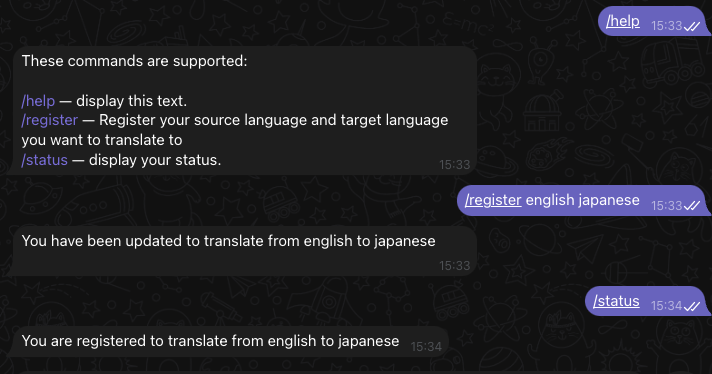
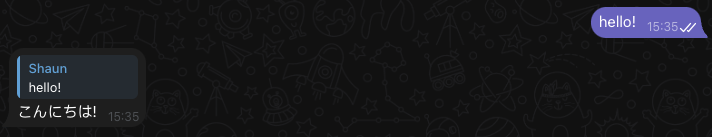

# Rustlator Bot

> Rustlator Bot is a personal side-project written in *rust* for exploratory purposes.

### Aim
Simply add this bot into your group chats and start receiving translations.

### Prerequisites
- libretranslate server (reachable via the internet or running locally via docker)
- telegram bot token from @Botfather
- allowed telegram bot to read messages via configuration @Botfather

### Quickstart
```
cp .env.sample .env
# populate the necessary variables
cargo run

```

### Usage
```
# in telegram
/register <source language> <target language>

# now just chat normally and the bot should reply to you
```

### Developer quickstart
```
# Not too sure what the appropriate tooling is for hot-reloading yet so I'm using `nodemon`

nodemon -e rs --exec "cargo run"
```

### Docker
> Running libretranslate through their official container has some compatibility issues with `compose` so this is still a work-in-progress

### FAQ
1. Why didn't I use the libretranslate crate ?
> It doesnt support as many languages as the standalone server
2. What languages are supported ?
> As many as libretranslate supports for now

### Screenshots

